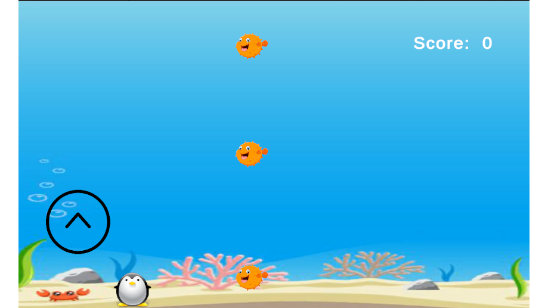

# Penguin Escape: Arctic Adventure

## Play Game: 

Join the Emperor Penguin in "Penguin Escape: Arctic Adventure"! Slide into the icy depths of the Arctic Ocean and help our feathery hero navigate a challenging journey back to the snowy haven. Face thrilling encounters with cunning sharks and leopard seals as you master the art of escape.



## Getting Started
The game is built with Unity editor version 2022.3.16f1.

### Prerequisites
- Unity and Unity Hub (v2022.3.16f1 or later): [Download](https://docs.unity3d.com/hub/manual/InstallHub.html).

## Running the Project
To run this project:

1. **Download the project**: Clone or Download this repository.
2. **Open Unity Hub**:
    - Launch Unity Hub on your computer.
3. **Add the Project to Unity Hub**:
    - Click the `ADD` button in the upper right corner.
    - In the dialog window, navigate to the location where you have downloaded the project.
    - Select the project folder and click `OK`.
4. **Open the Project**:
    - Find the project in the projects list in Unity Hub.
    - Double-click the project name to open it.

## Contribution Guideline
1. **Fork the Repository**:
    - Go to the GitHub repository and click the `Fork` button.
2. **Clone the Repository**:
    - Clone the forked repository to your computer:
      ```sh
      git clone git://github.com/<your_username>/Penguin-Glide.git
      ```
3. **Navigate to the Project Directory**:
    - Change to the project directory:
      ```sh
      cd Penguin-Glide
      ```
4. **Set Up Remote Upstream**:
    - Add the original repository as upstream:
      ```sh
      git remote add upstream git://github.com/hemanth-sunkireddy/Penguin-Glide.git
      ```
5. **Create a New Branch**:
    - Create a branch for the new issue or feature:
      ```sh
      git checkout -b new-feature-or-issue
      ```
6. **Open the Project in Unity Hub**:
    - Open Unity Hub and click `Add`, then select this repository.
7. **Develop the Game**:
    - Make your changes and improvements in the Unity Editor.
8. **Commit Changes**:
    - Stage and commit your changes:
      ```sh
      git add <file(s)>
      git commit -m 'A nice commit message'
      ```
9. **Fetch Upstream Changes**:
    - Fetch the latest changes from upstream:
      ```sh
      git fetch upstream
      ```
10. **Update Local Master Branch**:
    - Update your local master branch with the upstream changes:
      ```sh
      git checkout master
      git merge upstream/master
      ```
11. **Rebase Your Branch**:
    - Rebase your feature branch with the updated master:
      ```sh
      git checkout new-feature-or-issue
      git rebase master
      ```
12. **Push Your Branch**:
    - Push your feature branch to your forked repository:
      ```sh
      git push origin new-feature-or-issue
      ```
13. **Create a Pull Request**:
    - Go to your forked repository on GitHub, switch to the `new-feature-or-issue` branch, and press the `Pull Request` button.
14. **Update Local Master Branch**:
    - After your changes are merged, update your local master branch:
      ```sh
      git checkout master
      git pull upstream master
      ```
