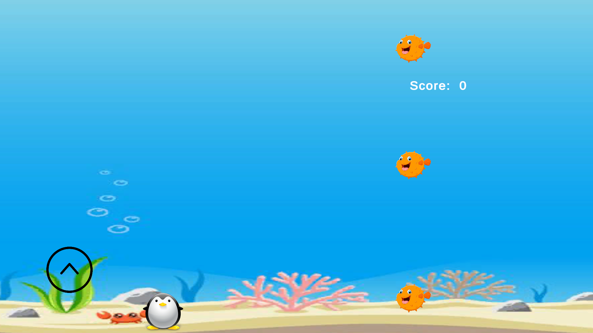

# Simple Game made with Unity

## Play the Game:
### Mobile - Google Playstore Link
```
  https://play.google.com/store/apps/details?id=com.defaultcompany.catchfish
```

### Browser - itch.io Link
```
  https://hemanth-sunkireddy.itch.io/penguin-glide
```


### Game: 



## About the game

The Emperor Penguin takes a wild plunge into the Arctic Ocean during an epic ice slide.
Now, our feathery hero faces the challenge of making its way up to the snowy haven, 
located at a tantalizing distance. But wait, the journey won't be a leisurely swim! 
Brace yourself for thrilling encounters with cunning sharks, 
and master the art of escape to ensure the penguin's safe ascent to the snowy summit.


### Devlelop the game 

1. Clone the repository or download the zip file.
2. Open the Unity Application and then selects this repository.
3. Modify script files and the attributes of the players.


